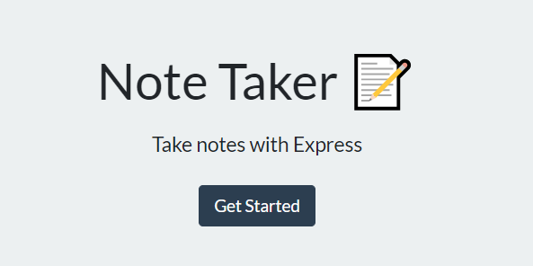
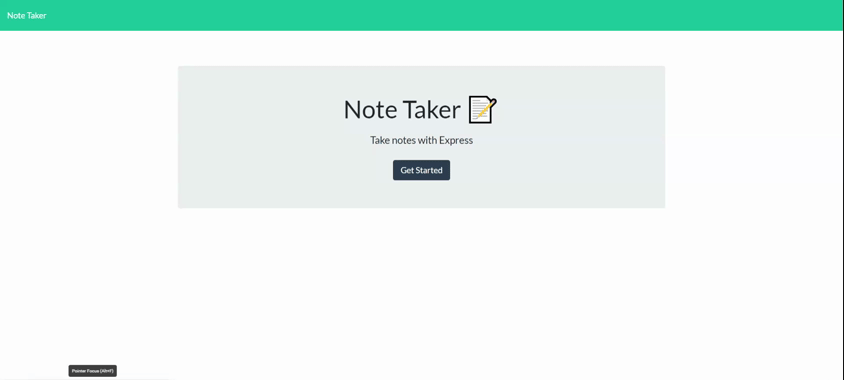

# NoteTakr

## Description 
  
An application called NoteTakr that can be used to write and save notes. This application uses an Express.js back end and will save/delete and retrieve note data from a JSON file.

## Installation

 [Run the app here](https://notetakr-jm.herokuapp.com/)

## Usage 

 

## Questions?

GitHub: [@jshmtchll](https://github.com/users/jshmtchll)

Email: jshmtchll@gmail.com